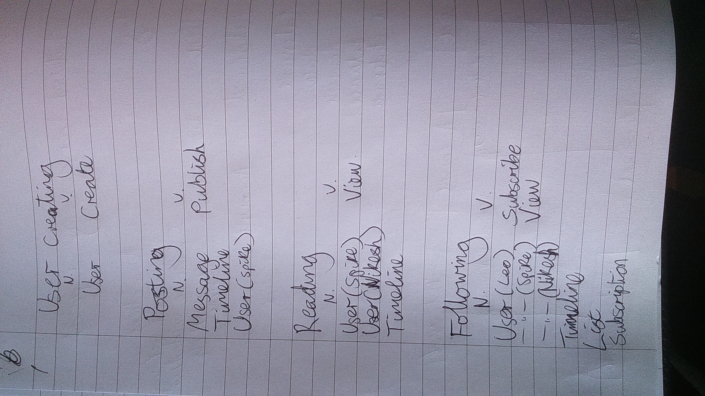
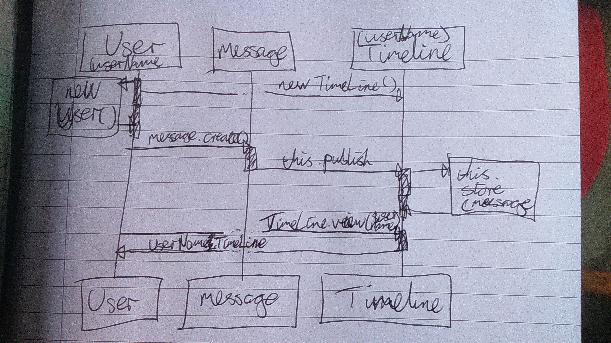

# The Java Social Network

## Instructions:

* please provide a solution in Java, as a GitHub link to Spike (on Slack) by 10am Monday

* submitted is better than complete (aka shipped is better than perfect)

* we are more interested in your design, approach and progress with Java than whether you manage to create a fully working command line app

​For tools, we recommend: Intelli-J as an IDE, JUnit for testing and Mockito for mocks (if you choose to mock)

​Good luck!

>”This is no time to take your chips down. A million dollars isn’t cool, you know what’s cool?"  

>”You?"  

>”A social network implemented in Java"

​**Implement a console-based social networking application (similar to _Twitter_) with the features below.**

​### Features:

**User creating**: a new user called *Spike* can be created  

**Posting**: *Spike* can publish messages to a personal timeline  

**Reading**: *Spike* can view *Nikesh’s* timeline  

**Following**: *Leo* can subscribe to *Spike* and *Nikesh's* timelines, and view an aggregated list of all subscriptions  

## Initial Design:

* Domain Mapping:

* Sequence Diagram:
